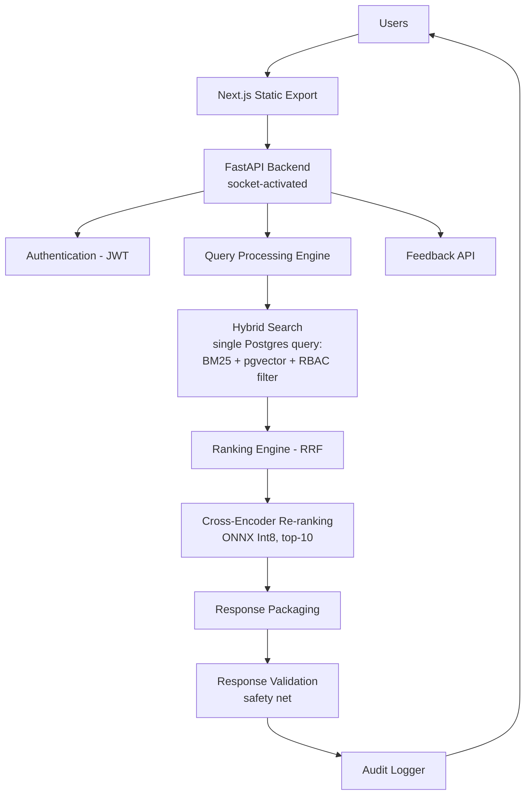
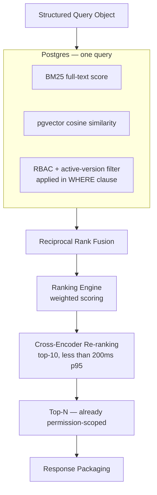
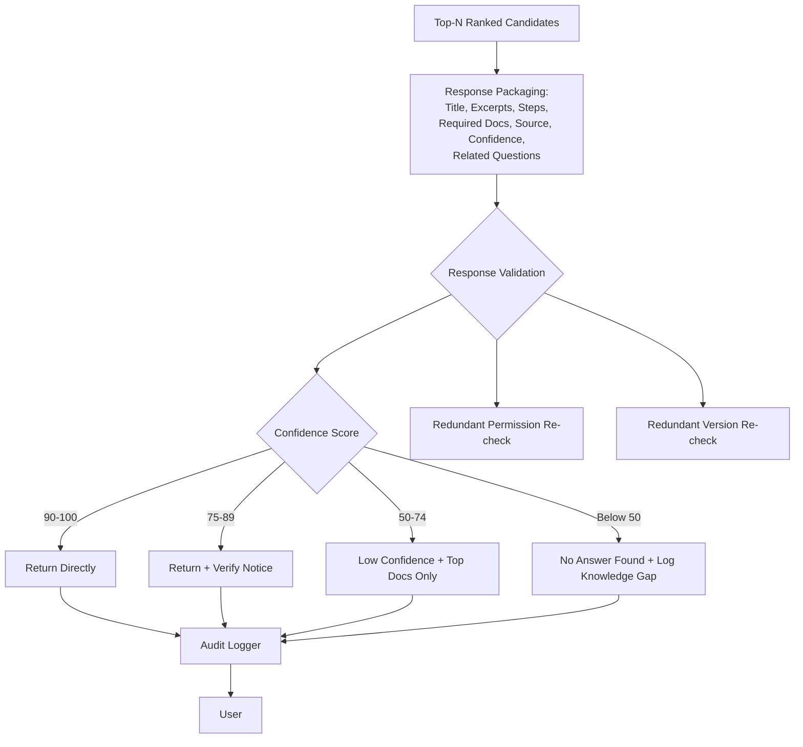
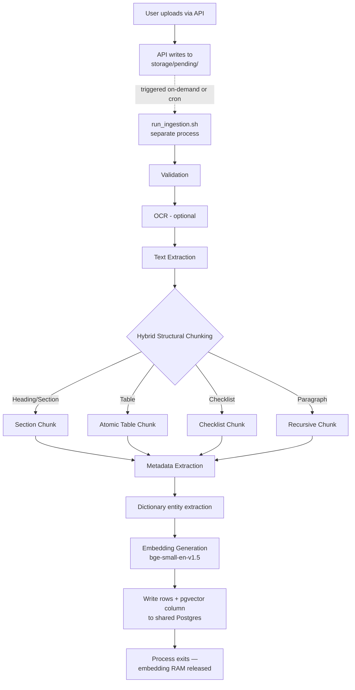
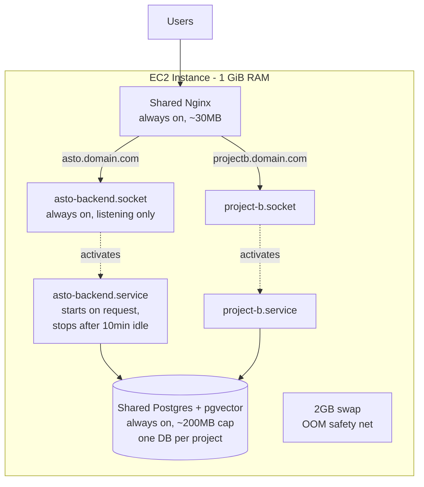
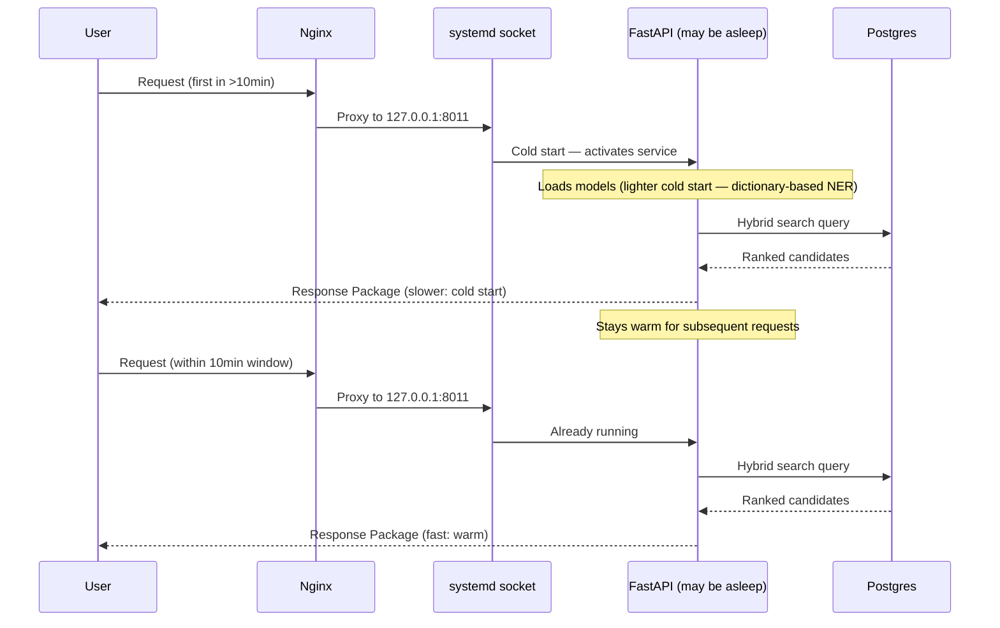
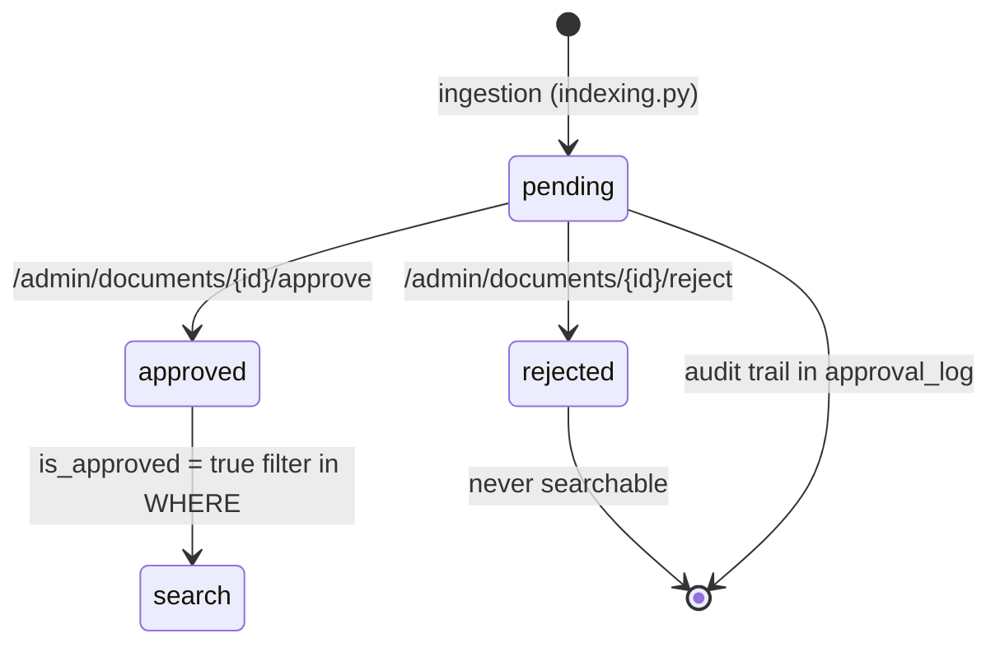

# Mortgage CRM Intelligent Knowledge Assistant — Final System Design (V3.2)

Consolidates the retrieval architecture (V3.1) and the shared-host
infrastructure decisions (V3.2 addendum) into one authoritative design
doc. Companion to `Final_Folder_Structure.md` and `Final_Tech_Stack.md`.

---

## 1. Design Philosophy

**"Find the right information, don't generate new information."**

No LLM anywhere in the pipeline. Every field in a response is retrieved,
never synthesized — this is the basis of the no-hallucination,
audit-friendly compliance story, and it constrains every design decision
below.

Two audiences share the same corpus with hard separation:
**internal staff** (department + assigned-client scope) and **external
clients** (their own `client_id` only). New documents are **pending by
default** and only become searchable after an admin approves them.

---

## 2. Full Request Flow (Application Layer)

```
                              USERS
                                │
                                ▼
                  Next.js Static Export + Shadcn/UI
                     (calls FastAPI directly — no BFF)
                                │
                                ▼
              FastAPI Backend (socket-activated, on-demand)
                                │
        ┌───────────────────────┼────────────────────────┐
        ▼                       ▼                        ▼
 RBAC Authentication           Query Processing         Feedback API
      (JWT)                     │
                                ▼
                    Query Processing Engine
        • Spell Correction  • Normalization  • Intent Detection
        • Dictionary-based entity extraction (entity_extraction.py)
        • Query Expansion   • Classification
                                │
                                ▼
        Hybrid Search Engine — single Postgres query
        • BM25 (full text)  • pgvector (cosine similarity)
        • RBAC + active-version metadata pre-filter
                                │
                                ▼
                  Ranking Engine (Reciprocal Rank Fusion)
        40% Semantic / 30% BM25 / 15% Metadata / 10% Feedback / 5% Freshness
        (initial default weights — tuned via Evaluation Framework)
                                │
                                ▼
              Cross-Encoder Re-ranking (ONNX Int8, top-10 candidates)
                     Latency budget: <200ms p95
                                │
                                ▼
                       Response Packaging
        Title • Matched Excerpts • Steps • Required Documents
        Source/Page/Section • Confidence Score • Related Questions
                                │
                                ▼
              Response Validation (redundant safety net)
        • Confidence-based routing  • Permission re-check
        • Active-version re-check
                                │
                                ▼
                     Audit Logger (every request)
                                │
                                ▼
                              USERS
```



---

## 3. Query Processing Engine — Detail

```mermaid
flowchart TD
    Q[User Query] --> SC[Spell Correction]
    SC --> NORM[Normalization]
    NORM --> ID[Intent Detection]
    ID --> NER{NER}
    NER --> ENT[Dictionary-based entity extraction<br/>(entity_extraction.py — no spaCy/GLiNER)]
    ENT --> QE[Query Expansion]
    QE --> QC[Query Classification]
    QC --> OUT[Structured Query Object]
```

---

## 4. Hybrid Search — Now a Single Postgres Query

The biggest structural change from V3.1: BM25, vector similarity, and
RBAC/version filtering are no longer three separate systems fused in
application code — they're one SQL query against the shared Postgres
instance.

```sql
-- Illustrative shape, not final SQL
SELECT chunk_id, content, source_doc_id,
       ts_rank(bm25_vector, query) AS bm25_score,
       1 - (embedding <=> :query_embedding) AS semantic_score
FROM document_chunks
WHERE is_active = true
  AND is_approved = true
  AND department = ANY(:user_allowed_departments)   -- RBAC pre-filter
ORDER BY (embedding <=> :query_embedding)
LIMIT 50;
```



**Why the pre-filter placement still matters even in one query:** the
`WHERE` clause excludes restricted/inactive rows before ranking or
reranking ever sees them — same principle as V3.1, now enforced by the
database itself rather than an application-layer filter step.

---

## 5. Response Packaging + Validation



Confidence thresholds (90/75/50) are initial defaults, tuned via the
Evaluation Framework — not fixed constants.

---

## 6. Document Ingestion — Decoupled Batch Pipeline

Ingestion runs as its own process (`run_ingestion.sh`), never inside the
always-on API process. The embedding model is the heaviest component in
the stack; loading it only for the duration of a batch job means that
memory is released back to the OS when the job ends, instead of being
held 24/7.



---

## 7. Shared-Host Deployment Architecture



At idle, only Nginx (~30MB) and Postgres (~200MB cap) are resident —
roughly 230MB baseline. Individual project backends wake on traffic and
sleep after 10 minutes idle, which is what makes multiple projects
coexist on 1 GiB — not smaller per-project footprints, but zero
footprint while idle.

---

## 8. End-to-End Sequence (Cold Start vs. Warm)



---

## 8b. Dual-Audience Authentication (staff + clients)

Added 2026-08-08 (Sessions 3–4). Two audiences, one token, two resolution
paths — scoping is always applied at the SQL `WHERE` clause, never post-hoc.

```mermaid
flowchart TD
    L[Login] --> S{Which audience?}
    S -->|/auth/login| STAFF[users table<br/>role, department,<br/>allowed_departments]
    S -->|/auth/client-login| CLIENT[clients table]
    STAFF --> T[Create JWT<br/>audience = "staff"]
    CLIENT --> TC[Create JWT<br/>audience = "client"<br/>+ client_id claim]
    T --> V[get_current_user<br/>resolves staff → users]
    TC --> VC[get_current_user<br/>resolves client → clients]
    V --> Q[Search WHERE clause<br/>department ∩ assigned clients]
    VC --> QC[Search WHERE clause<br/>client_id = own only]
```

- **Staff JWT claims:** `sub`, `role`, `department`, `allowed_departments`,
  `audience="staff"`, `iat`, `exp`.
- **Client JWT claims:** `sub` (client id), `role="client"`,
  `audience="client"`, `client_id`, `iat`, `exp`. The `client_id` claim is
  trusted only for identity; row-level scoping is re-resolved from the DB at
  query time (CLAUDE.md rule #1).
- **Authorization is fail-closed:** `require_role` denies client-audience
  tokens on staff-only endpoints, and `client.py`'s `_require_client` denies
  staff tokens on client-only endpoints. Both enforced server-side.
- **Client self-service API** (`/api/v1/client/*`): `me`, `properties`,
  `cases`, `documents` (approved only). All scoped by the authenticated
  `client_id` — never taken from the request body.

---

## 8c. Document Approval Workflow

Added 2026-08-08 (Session 3). New documents are **pending by default** and
invisible to search until an admin approves them. This prevents un-vetted
content from ever being surfaced to staff or clients.



- **State machine:** `pending → approved | rejected`. `approval_log` records
  every transition (document_id, reviewed_by, from_status, to_status, reason,
  created_at) — the reviewer audit trail required by the compliance story.
- **Transactional:** a document AND all its chunks transition together in one
  transaction, so a partially-approved document can never leak into search.
- **Search integration:** `metadata_filters.py` requires
  `is_approved = true` in the same `WHERE` clause as the RBAC/version filter —
  pending/rejected rows never reach ranking or the reranker.
- **Admin API** (`api/v1/approvals.py`): list pending, approve, reject,
  history. Writes the same `approval_log`; backed by `require_role(user, "admin")`.

---

## 9. Component Responsibility Summary| Component | Responsibility | Enforcement / Lifecycle |
|---|---|---|
| Query Processing Engine | Clean and structure the raw query | Always-on, lightweight |
| Hybrid Search (Postgres + pgvector) | Retrieve candidates; **enforce RBAC + active-version + approval filtering in the WHERE clause** | Primary enforcement point |
| Ranking Engine (RRF) | Fuse BM25 + semantic scores with metadata/feedback/freshness | Post-filter |
| Cross-Encoder Reranker | Precision-rank top-10 candidates (not generative) | Post-RRF, <200ms p95 |
| Response Packaging | Assemble retrieved content into a structured package | Post-rank |
| Response Validation | Redundant safety-net check; confidence-based routing | Last-mile, non-primary for permissions |
| Audit Logger | Immutable record of every query | Every request |
| Approval Workflow (B3) | Pending/approved/rejected state machine + reviewer audit trail | Transactional, admin-only |
| Dual-Audience Auth (C) | Staff + client JWT resolution; client-scoped API | Server-side, fail-closed |
| Evaluation Framework | Measure retrieval quality on every ranking/weight/threshold change | CI-gated |
| Ingestion Batch Pipeline | OCR, chunking, entity/embedding extraction | On-demand, non-resident |
| Systemd Socket/Service | On-demand backend activation | Idle-stopped after 10 min |
| Shared Postgres + Nginx | Cross-project shared infra | Always-on, capped memory |

---

## 10. Key Design Decisions (Rationale)

1. **No abstractive generation anywhere.** "Answer" → "Response Package";
   every field is retrieved, never synthesized. The one deliberate
   exception is an **extractive summary** (`response/summarizer.py`, Sumy
   TextRank) that selects up to 4 sentences verbatim from the top excerpts
   and maps each back to its source — it never paraphrases or invents text.
2. **RBAC/version filtering is a pre-filter, in the database WHERE
   clause**, not a late validation gate — closes both a security gap and
   avoids wasted reranking compute.
3. **pgvector replaces Qdrant.** One database process instead of two;
   BM25 + vector + RBAC filtering collapse into a single SQL query.
4. **Redis and MinIO dropped for MVP.** Neither is a hard dependency;
   both can be reintroduced once real traffic justifies the RAM cost.
5. **Ingestion is decoupled from the API process.** The
embedding model is the heaviest component — it runs only for the
duration of a batch job, never resident 24/7.
6. **Backend is socket-activated and idle-stopped**, not always running.
   This — not per-service tuning — is what makes multiple projects
   coexist on 1 GiB RAM.
7. **Reranking latency (<200ms p95) and cold-start latency are both
   tracked as explicit metrics** in the Evaluation Framework, not
   assumptions.
8. **Ranking weights and confidence thresholds are configuration**,
   documented as initial defaults, expected to shift based on benchmark
   results.
9. **Audit logging is separate from analytics** — compliance artifact,
   immutable, per-query.
10. **CPU credit contention across shared-host projects is a known,
     unsolved risk** — tracked via a dedicated Grafana dashboard, not
     mitigated by this architecture. A project needing consistent low
     latency should move to its own instance.
11. **Documents are pending-by-default and approval-gated.** No ingested
     document becomes searchable until an admin approves it; the approval
     filter lives in the search `WHERE` clause with RBAC (CLAUDE.md rule #1
     extended to the approval gate). This is what keeps the compliance story
     intact end-to-end.
12. **Client access is an approved subset of the same corpus.** Clients can
     only ever retrieve documents explicitly tied to their own `client_id`
     AND approved — the intersection is enforced in one SQL predicate, so
     there is no code path where a client sees a colleague's or an
     un-vetted document.
